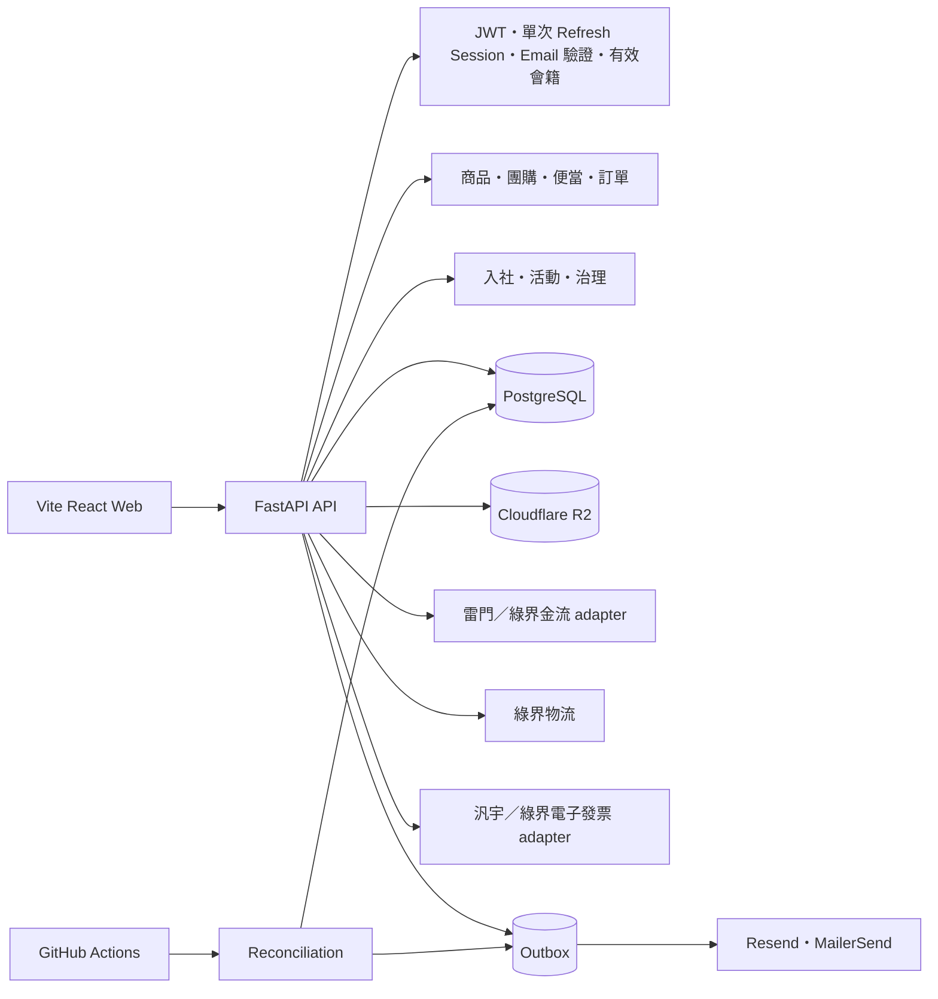

# 十里方圓系統架構

## 系統全貌



`web/` 是唯一前端。它只負責畫面狀態與使用者操作，不判斷最終資格、價格、容量或付款結果；FastAPI 依資料庫狀態回傳可執行動作。

## 前端模組

- 公開：首頁、商品、商品詳情、團購、便當、登入／註冊與說明。
- 交易：購物車、試算、結帳、物流選擇、付款續辦、訂單與取餐憑證。
- 社務：入社進度、社員名錄、活動、治理提案、積點、願望、會議與結餘。
- 管理：總覽、商品／供應者／取貨點、團購、便當、訂單／物流／退款、社務與財務。
- 共用：`AuthProvider`、`CartProvider`、API client、commerce orchestration、route-based lazy loading。

## 身分與入社

```text
User                    登入帳號與 customer/admin 權限
MembershipApplication   入社申請與文件審核
Membership              一般買家、實習社員、正式社員狀態
MemberRosterEntry       尚未連結線上帳號的既有正式社員名冊
MemberProfile           AES-GCM 加密私密資料
MemberDirectoryEntry    社員自願公開資料
```

`memberships.status` 是資格真相。`trainee` 與 `active` 都取得社員價；只有 `active` 可使用正式社員的活動、名錄與治理功能。`MemberRosterEntry` 本身不授權任何線上操作，只有名冊資料核對成功並連結至 `User` 後才建立 `active` 會籍。

## 銷售與履約

```text
sales_channel       regular | group | meal_preorder
fulfillment_method  cooperative_pickup | event_pickup | ecpay_logistics
```

訂單保存商品名稱、價格、稅別與下單身分快照。物流保存於 `Shipment`，同張訂單限制單一溫層、地址及包裹。金流與物流託管頁完成後，一律由 FastAPI 重新導向 Web 的 `/orders` 或 `/account`。

每筆 `PaymentAttempt` 都保存建立當下的 provider，切換全域設定後，舊交易仍由原 provider 查單與退款。雷門目前沒有主動付款通知；瀏覽器 `return_url` 只觸發 server-to-server 查單，本身不具付款效力。使用者未回站時由排程補查，並比對商店訂單號、平台交易號、金額、付款方式與商店代碼。完整狀態與安全邊界見 `docs/PAYMENT_FLOW.md`。

管理財務依身分快照分成一般買家、實習社員及正式社員，僅加總已付款、未退款的商品小計，不含運費。

電子發票在後端驗證付款成功後，以同一資料庫交易排入 Outbox；另保存成功付款、買方資料、實際供應商 `reqData` 與小數品項快照。Worker 開票前先以銷貨單號查詢供應商，查無資料才開立；管理端也可填原因重查並留下稽核紀錄。汎宇正式切換條件與 Email 分工見 `docs/INVOICE_FLOW.md`。

## 團購與便當

- 團購提案與正式團購分離；只有付款成功數量計入成團。
- 達標後由管理員確認成團，才能建立正式物流單。
- `Meal` 是可重用餐點；`MealEvent` 是單次取餐場次。餐點選項由群組定義必選數量與加價，訂單會保存選項名稱及價格快照，避免日後改菜單影響既有訂單。
- 便當建立付款頁時保留容量 15 分鐘；付款後產生六位短碼與 QR token。
- 核銷具冪等性；取餐結束後未領取標記 `no_show`。

## 社員活動與治理

活動由正式社員建立、管理員審核；額滿後依排隊順序候補與遞補。治理提案採 `yes / no / abstain` 公開記名票，棄權計入最低投票數，且贊成票必須多於反對票。

## 私密資料與外部服務

- 姓名、電話、地址以版本化 AES-256-GCM 儲存。
- R2 Bucket 不公開，PUT 簽名 URL 5 分鐘、GET 2 分鐘；通過檔頭、大小與 SHA-256 驗證後才從 pending key 搬到 verified key。
- Payment 與物流外部事件以 `ExternalEvent` 去重；雷門付款以回跳立即查單、前端短暫補查與背景 reconciliation 收斂狀態。
- Email 先寫入 Outbox，驗證碼與重設憑證加密保存；Resend 失敗時可由 MailerSend 備援。
- `POST /internal/reconcile` 處理逾期保留、付款查單、團購、活動、便當、provider 退款、發票與通知。
