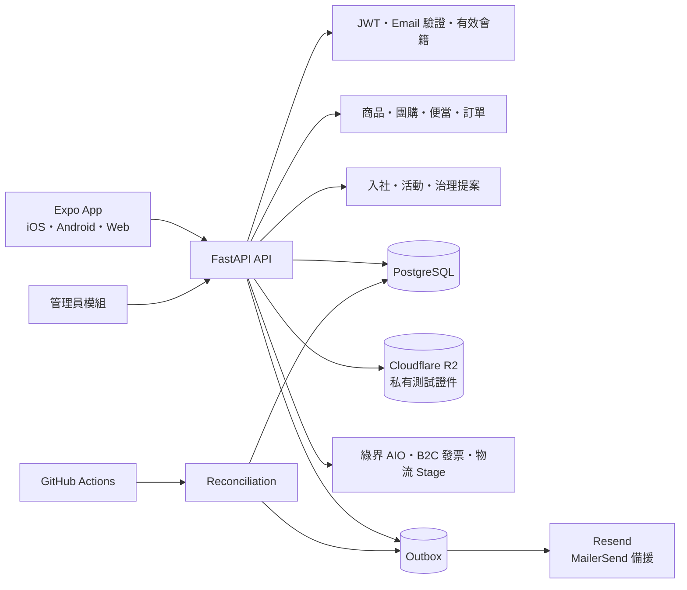
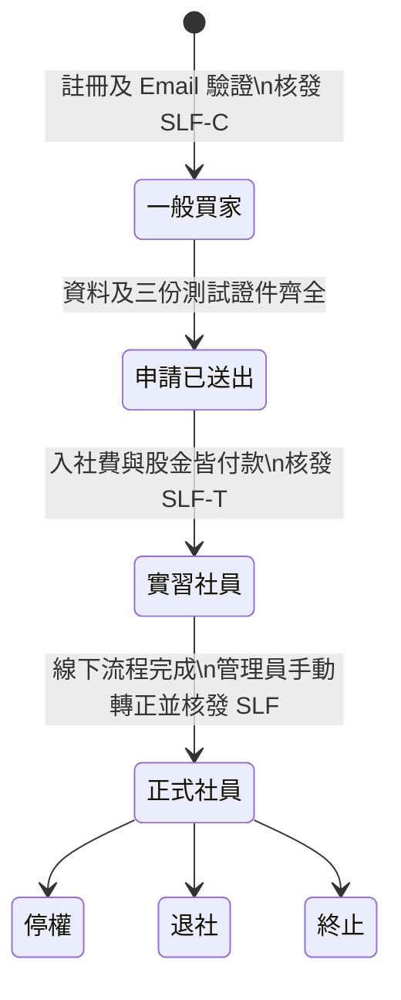

# 十里方圓 v2 系統架構

## 系統全貌



前端不判斷最終社員資格、價格、付款結果或可執行動作。FastAPI 依會籍狀態與資料庫狀態計算：實習社員與正式社員使用社員價，正式社員權限只開放給 `memberships.status=active`；訂單回傳 `available_actions`、`fulfillment` 與 `shipment`。

驗證信、密碼重設與交易通知先寫入 Outbox；API 僅回報 `queued`，不把排入佇列誤稱為已寄達。重寄驗證信時，舊驗證碼會保留到新信被供應商接受，再由背景工作淘汰，避免寄信失敗造成帳號無法驗證。

## 兩個工作區

- `生活消費`：首頁、團購、便當、訂單、我的；購物車放在頁首。
- `社務系統`：社務首頁、社員、活動、提案、更多；個人資料、積點與徽章、願望、會議及結餘分配收在「更多」。
- `WorkspaceContext` 分別記住兩個工作區最後開啟的頁面。
- 管理端以總覽、販售、訂單與物流、社務、設定為模組入口。

一般商品、團購與便當共用 `CatalogCard`：手機兩欄、圖片 4:3；詳情圖 3:2 並限制高度。團購只額外顯示狀態、截止、門檻與細進度條。

## 身分與入社

```text
User                    登入帳號、SLF-C 一般買家編號與 customer/admin 管理權限
MembershipApplication   入社申請與審核
Membership              會籍、SLF-T 實習社員編號與 SLF 正式社員編號
MemberProfile           AES-GCM 加密私密資料
MemberDirectoryEntry    自願公開資料
```

`users.membership_type` 是 migration 相容欄位，不是資格真相。`memberships.status=trainee` 與 `active` 都取得社員價；只有 `active` 正式社員能使用社員名錄、活動、治理提案、積點、願望、會議及結餘分配。



入社申請的資料審核與付款是兩條獨立進度：申請送出後即建立入社費及股金，不必等待管理員核准才付款；管理員仍可要求補件、核准或駁回。兩款皆付款成功後會籍進入 `trainee`。入社訓練、面試及後續確認在線下進行，系統不保存教育講義、測驗或訓練完成狀態；管理員確認後才手動將會籍轉為 `active`。

入社費與股金是通用付款主體 `membership_charge`，不建立銷售訂單、不開電子發票，只產生系統收據。

## 社員活動與治理提案

活動由正式社員建立、管理員審核。正式名額依 `queue_position` 排序；滿額後進候補，正式名額取消時自動遞補最早候補者。活動結束後未簽到者由 reconciliation 標記 `no_show`。

治理提案與商品團購提案使用不同資料表及狀態：

```text
draft → pending_review → discussion → voting → passed/rejected → closed
```

預設討論 3 天、表決 7 天、最低 10 名正式社員。`yes/no/abstain` 是公開記名票；棄權計入最低投票數但不進入贊成率，只有 `yes > no` 才通過。

## 銷售與履約

訂單分成兩個獨立維度：

```text
sales_channel       regular | group | meal_preorder
fulfillment_method  cooperative_pickup | event_pickup | ecpay_logistics
```

`OrderFulfillment.status` 是履約資格真相：

```text
pending_confirmation | preparing | ready_for_pickup | picked_up |
awaiting_shipment | shipped | delivered | no_show | cancelled
```

`orders.fulfillment_status` 只保留舊資料相容。物流細節保存於一對一 `Shipment`；價格、品名、稅別及下單時身分 `nonmember | trainee | member` 都保存在訂單快照。

管理端身分別銷售以 `orders.membership_type_snapshot` 分成一般買家、實習社員與正式社員。各類銷售額只加總已付款、未退款訂單的 `OrderItem.subtotal`，不含運費；各類比例使用三類商品銷售總額作為共同分母。

## 便當容量

1. `Meal` 是可重用餐點；`MealEvent` 是單次校園／攤位場次。
2. `MealEventOffering` 保存該場次價格、容量、保留量及已付款量。
3. 建立付款頁時以資料庫鎖保留 15 分鐘。
4. 截止前建立的付款，允許在保留期限內跨過截止完成。
5. 核銷六位短碼後標記 `picked_up`；取餐結束仍未領取者標記 `no_show`。
6. `picked_up` 與 `no_show` 都會進入發票 Outbox；未取不退款。

## 物流

- 商品／團購設定 `can_ship`、溫層及允許通路。
- 同一訂單必須是單一溫層、單一地址、單一包裹，不相容時要求分開結帳。
- 收件人姓名、電話、地址使用版本化 AES-256-GCM。
- 綠界物流 Selection callback 以一次性 token 綁定訂單；Server callback 以 `ExternalEvent` 去重。
- 團購在管理員確認成團且進入備貨後才建立正式物流單。
- Stage 後續貨態由管理員 Sandbox 按鈕推進，每次寫入 `AdminAudit`；正式環境只接受已驗證回呼。

## 私密證件

- R2 Bucket 不啟用公開網域。
- PUT 簽名 URL 5 分鐘、管理員 GET 2 分鐘。
- 只允許 JPEG、PNG、PDF，單檔最多 8MB。
- object key 完全隨機，不包含姓名、電話或證件號。
- 確認時以 HEAD 驗證 Content-Type、大小與 SHA-256。
- 私密資料及證件只供本人與管理員；管理員查看、補件與刪除皆留稽核。
- `sandbox` 缺少 R2、PII 或物流密鑰時 API 拒絕啟動。

## 金流、發票與背景工作

`PaymentAttempt` 與 `Refund` 都只能指向 `order` 或 `membership_charge` 其中一種。綠界回呼驗證簽章、商店、交易編號、金額與狀態，並以 `ExternalEvent` 防止重複及亂序。

Web 的付款與物流結果會以 HTTPS 回到 FastAPI，再重新導向 Web 訂單或社員頁。development build 與 production build 會在託管頁網址加上 `client=native`，由後端改以 `shilifangyuan://payment-return` 或 `shilifangyuan://logistics-return` 返回 Expo Router；Expo Go 無法保證承接自訂 scheme，使用者切回 App 後由訂單／會籍查詢取得最終狀態。

發票資格：

- 合作社／活動現場取貨：核銷完成。
- 物流：確認送達。
- 便當未取：場次結束並標記 `no_show`。
- 入社費與股金：不開發票。

`POST /internal/reconcile` 處理付款保留、團購截止、治理提案時鐘、活動結束、便當截止／未取、Sandbox 退款、發票與 Email Outbox。GitHub Actions 定期呼叫，API 請求也提供 lazy reconciliation。
