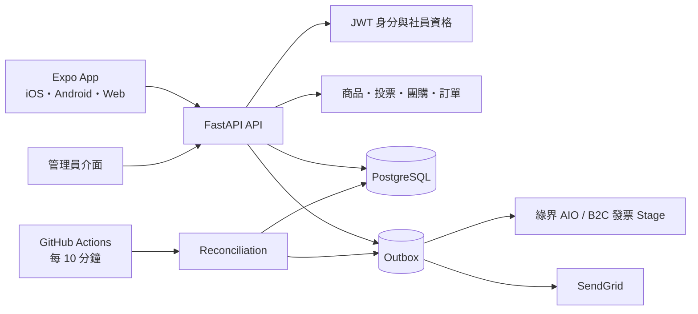
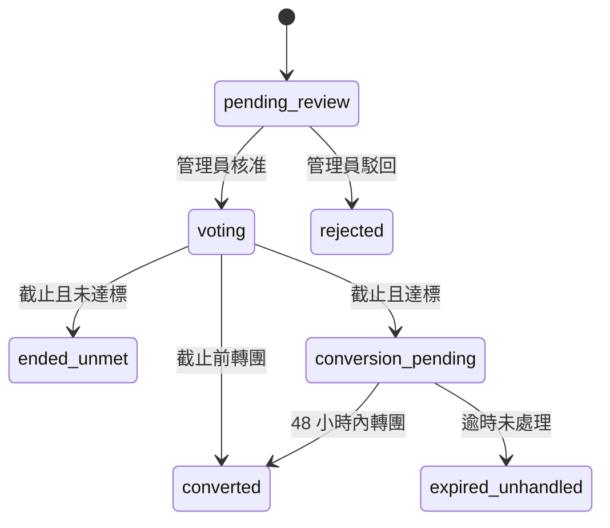
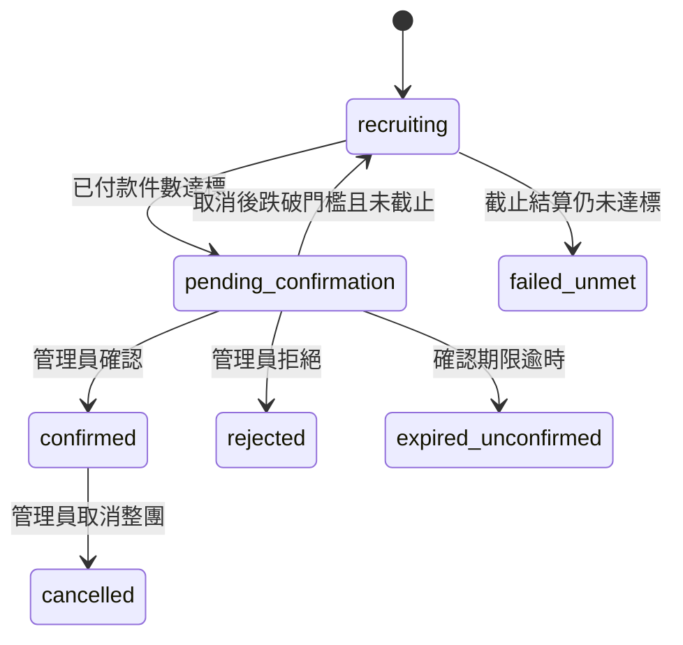

# 十里方圓系統架構

## 系統全貌



前端不決定最終價格、付款結果或可執行動作。FastAPI 依 JWT 身分重新計價，並在回應中提供 `available_actions`。

## 身分模型

管理權限與社員資格分開保存：

```text
user_role       customer | admin
membership_type member | nonmember
```

訪客可讀取公開商品、投票與團購；建立提案、投票、購買、取消及查看個人訂單必須登入。

展示版使用三個後端 seed 帳號及 JWT。正式社員資料庫、註冊及忘記密碼不在本階段。

## 主要資料

- `users`：登入、管理角色及社員資格
- `products`：商品、分類、雙價格、庫存及稅別
- `group_bundles`、`group_bundle_items`：只供團購使用的固定套組
- `vote_proposals`、`votes`：提案審核、一人一票及預估數量
- `group_campaigns`：正式團購、獨立配額及成團狀態
- `orders`、`order_items`：一般與團購的統一訂單、價格及稅別快照
- `inventory_reservations`：15 分鐘付款保留
- `payment_attempts`、`refunds`：付款嘗試與本系統 Sandbox 退款
- `invoices`：B2C 發票結果及重試狀態
- `notifications`、`outbox_events`：App 通知與外部工作
- `external_events`、`admin_audits`：回呼冪等與管理員稽核

所有金額使用整數新台幣。時間在資料庫使用 UTC，App 以 Asia/Taipei 顯示。

## 投票狀態



投票中的達標是即時計算結果，不是不可逆狀態。截止後保存票數快照，不再允許修改或撤回。

## 正式團購狀態

團購結果與接單能力分開：

```text
decision_status recruiting | pending_confirmation | confirmed |
                rejected | failed_unmet | expired_unconfirmed | cancelled

intake_status   open | paused | settling | full | closed
```



- 達標待確認時 `intake_status=paused`。
- 截止時仍有有效付款保留則 `intake_status=settling`，查完最後一筆付款再判定。
- 截止後因付款保留才達標，管理員有 24 小時確認；確認後直接結單。
- 首筆付款前，只要存在有效保留就暫停核心條件修改；首筆成功後永久鎖定。

## 訂單與付款

履約、付款與發票各有獨立狀態：

```text
fulfillment pending_confirmation | preparing | ready_for_pickup |
            picked_up | cancelled

payment     pending | paid | late_paid_refund_required |
            refund_pending | refunded | failed | expired

invoice     not_eligible | pending | issued | failed
```

付款流程：

1. API 重新計價並建立訂單。
2. 建立 15 分鐘庫存／團購名額保留及唯一付款嘗試。
3. 後端產生 HTML Form POST，瀏覽器導向綠界。
4. `ReturnURL` 驗證 CheckMacValue、商店、編號與金額。
5. 必要時呼叫綠界訂單查詢；資料庫交易只允許第一次合法成功。
6. 成功後消耗保留、更新訂單及團購數量，寫入 Outbox。
7. 逾時先查詢再釋放；無法重新取得名額的晚到付款進入退款。

`OrderResultURL` 只負責瀏覽器返回，不是付款成功依據。

## 發票與通知

管理員標記 `picked_up` 時，在同一資料庫交易建立發票 Outbox：

1. 依訂單品項與稅別快照建立 B2C 發票。
2. 綠界請求逾時時，以原 `RelateNumber` 查詢，避免重開。
3. 成功後保存發票號碼、日期與隨機碼。
4. 建立 App 通知，並由 SendGrid 寄 App 開立通知。

Email 只處理重要事件。Outbox 以事件鍵去重，Email 失敗不回退付款、取貨或發票狀態。

## 背景結算

`POST /internal/reconcile` 受 `X-Reconcile-Secret` 標頭保護，處理：

- 投票截止及 48 小時轉團期限
- 團購截止、付款保留及管理員確認期限
- 逾時付款查詢與庫存釋放
- Sandbox 退款
- 發票與 Email Outbox

GitHub Actions 每 10 分鐘呼叫一次；相關 API 請求也執行 lazy reconciliation，降低免費 Render 排程延遲的影響。
