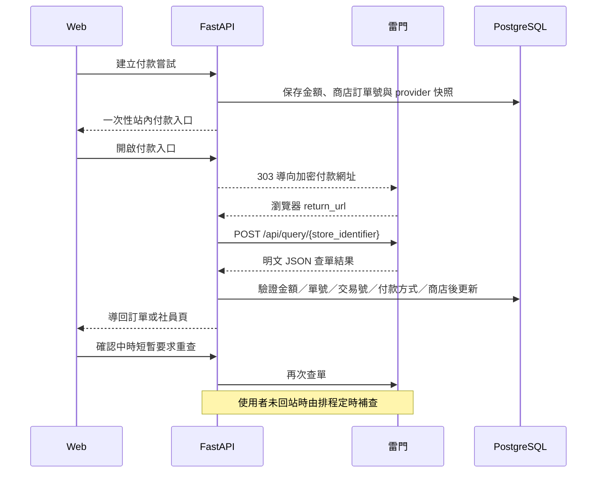

# 雷門線上多元支付流程

## 實作範圍與安全邊界

本整合依「雷門支付整合＿線上多元支付 API 介接規格 v1.6.5（2024-09-25）」實作。目前程式已具備建立付款頁、回跳後主動查單、定時補查、付款狀態對照與全額退款介面；在完成端到端驗收前，仍不得開放真實款項。

雷門已確認目前沒有主動付款或退款通知，因此平台不依賴 Callback。瀏覽器回跳只用來觸發後端查單，本身不能證明付款成功；只有伺服器呼叫雷門查單 API，取得 `return_code=0000` 且 `status=2`，才會把訂單標成已付款並排入發票。使用者未回站或第一次查單尚無結果時，前端會短暫重查，之後由排程繼續補查。

## 付款資料與加密

- 付款入口：`GET {base_url}/calc/pay_encrypt/{store_identifier}`。
- `TransactionData` 是 AES-256-CBC、PKCS#7 padding 後的標準 Base64；Key 與 IV 由雷門以十六進位字串提供。
- `HashDigest` 是 Base64 字串本身的 SHA-256 十六進位結果，再與 `TransactionData` 一起做 URL encoding。
- 金額一律由後端既有訂單或社員款項計算，前端不能指定。
- `pos_order_number` 使用平台付款嘗試的唯一商店訂單號；每次嘗試也保存當下的 provider，日後切換金流不會拿新 provider 處理舊交易。
- `return_url` 指向 `{APP_BASE_URL}/payments/raygate/result?attempt_id=...`，回跳後立即由後端查單。
- 付款參數仍依既有介面帶入 `callback_url` 相容欄位，但雷門已確認目前不會主動呼叫；平台不以此欄位作為付款確認來源。

付款資料雖已加密，仍會出現在 GET query string。站內導向回應已設定 `Cache-Control: no-store` 與 `Referrer-Policy: no-referrer`；部署時也要確認反向代理、CDN、APM 與雷門端不會長期保存完整 query string。

## 主動查單與狀態規則

後端以保存於付款嘗試的 `pos_order_number` 查單，並驗證以下欄位：

- 商店訂單號 `pos_order_number`
- 平台交易號 `order_id`
- 金額 `amount`
- 付款方式 `pay_type`
- 商店代碼 `store_code`

目前採保守狀態對照：

| 雷門 `status` | 平台處理 |
|---|---|
| `0` | 未取得成功證據，維持可補查 |
| `1` | 維持確認中 |
| `2` 且 `return_code=0000` | 唯一會標記付款成功的組合 |
| `3` 且 `return_code=0000` | 已退款 |
| `4` | 未取得最終退款結果，交由退款查詢與人工核對 |
| `5` | 維持確認中 |

除了已確認的成功與退款組合，其餘回傳都不會提前落成不可再查的最終失敗。查單結果會以交易欄位產生事件鍵並透過 `ExternalEvent` 去重。付款成功後沿用既有交易邏輯：確認庫存或容量、更新訂單／社員款項、建立通知，並在同一資料庫交易排入電子發票 Outbox（入社費與股金除外）。

`POST /webhooks/raygate/payment` 暫時保留為防禦性相容路由，但不列入正式流程或驗收依賴。

## 查單、補償與退款

查單與退款都由後端呼叫，使用下列 Header：

- `X-ePay-MerchantID`
- `X-ePay-TerminalID`
- `X-Merchant-DeviceType`（雷門有核發時才提供）

查單使用 `POST {base_url}/api/query/{store_identifier}`。回跳時立即查一次；確認中頁面最多主動補查兩分鐘，採 5 秒後放慢到 15 秒；背景 reconciliation 涵蓋有效期內的雷門付款，逾期後依 `RAYGATE_PAYMENT_RECONCILE_HOURS` 繼續有限補查。付款 reconciliation 依付款嘗試保存的 provider 選擇 adapter，不會因日後切換 `PAYMENT_PROVIDER` 而誤查舊交易。

2026-09-05 本機修復新增 `next_reconcile_at`（migration `0013_payment_poll_schedule`）：依可查時間公平排序，取批次後逐筆以條件更新預約下一次查詢，提交後才呼叫供應商。查詢失敗也保留間隔，不讓前幾筆一直占滿批次；耗時批次依實際取件時間計算間隔。未查過的舊資料維持 NULL、可正常納入，不變更交易號碼、金額、provider payload 或既有補查期限。這是排程資料，不取代付款回應驗證與事件冪等保護；PostgreSQL 多程序併發仍須另行驗收。

常駐 API 可啟用 `RECONCILIATION_ENABLED=true`，每輪完成後依 `RECONCILIATION_INTERVAL_SECONDS` 等待（預設 60 秒、最低 30 秒），沿用單 process 防重疊機制。不需瀏覽器回站才處理後續發票／通知，但仍須部署並確認設定。GitHub 排程保留為外部補跑，缺少 Secrets 或預設分支版本過舊仍需修正。

已取消訂單拒絕建立新付款；已發出的平台 checkout 連結也會檢查取消狀態而回覆失效。已送達供應商的付款頁無法由本機檢查撤回，因此既有「取消後才查到付款成功」的補償／退款保護仍保留。

退款使用 `POST {base_url}/api/refund/{store_identifier}`。現有規格的退款請求只有 `order_id` 與原付款方式 `refund_type`，沒有退款金額，因此平台只允許全額退款。Worker 在送出退款前先查單；若已是 `status=3` 則視為先前退款已完成，否則只有確認仍為已付款狀態才呼叫退款。退款紀錄保存原付款嘗試、provider、雷門退款單號與供應商回應，供重試與稽核使用。

由於 v1.6.5 沒有可傳送的退款冪等鍵，平台會在第一次呼叫退款前先持久化「已開始送出」標記。若請求逾時、斷線或回應無法判讀，後續自動重試只查單，不會再次送出退款；必須等查單確認 `status=3`，或由人工與雷門核對後處理，避免重複退款。雷門明確回報退款失敗，或退款工作耗盡重試時，Outbox 會保留失敗紀錄並通知所有管理員人工核對，不會無聲停止或自動重送不明退款。

全額退款完成後會排入發票作廢流程；外部開票前會先持久化固定的發票關聯編號與請求快照，因此即使開票回應尚未寫回就中斷，退款流程仍能建立發票作廢待辦。部分退款、跨期退款與折讓，則在會計規則與供應商能力確認前不會自動執行。

## 環境變數

切換雷門時設定：

| 變數 | 用途 |
|---|---|
| `PAYMENT_PROVIDER=raygate` | 新付款嘗試改用雷門；既有嘗試仍依 provider 快照處理 |
| `RAYGATE_PAYMENT_BASE_URL` | 雷門提供的 Sandbox 或正式 HTTPS 根網址，無內建預設值 |
| `RAYGATE_PAYMENT_ALLOWED_HOSTNAME` | 雷門書面確認的精確主機名稱；必須與 `BASE_URL` 完全一致，用來阻擋誤設內網或釣魚網址 |
| `RAYGATE_PAYMENT_STORE_IDENTIFIER` | 商店識別字串，用於付款、查單與退款 URL path |
| `RAYGATE_PAYMENT_KEY_HEX` | 64 位十六進位字元（32-byte）的 AES Key |
| `RAYGATE_PAYMENT_IV_HEX` | 32 位十六進位字元（16-byte）的 AES IV |
| `RAYGATE_PAYMENT_MERCHANT_ID` | 查單／退款 Header 使用的商戶編號 |
| `RAYGATE_PAYMENT_TERMINAL_ID` | 查單／退款 Header 使用的終端機編號 |
| `RAYGATE_PAYMENT_DEVICE_TYPE` | 選填設備代碼；預設不送，只有雷門明確核發時才設定 |
| `RAYGATE_PAYMENT_STAGE` | Sandbox 設 `true`、Production 設 `false` 的部署安全閘門；網址仍由 `BASE_URL` 明確指定 |
| `RAYGATE_PAYMENT_CONTRACT_VERIFIED` | 完成回跳查單、定時補查、狀態與退款契約驗收後才設 `true`；正式環境未確認時會拒絕啟動 |
| `RAYGATE_PAYMENT_RECONCILE_HOURS` | 付款逾期後仍主動補查的時數，預設 24；期限結束後須納入人工對帳 |
| `RAYGATE_PAYMENT_ACCEPTANCE_ORDER_ID` | 僅供 Preview 正式小額驗收；填入唯一訂單 UUID 後，只放行該筆 NT$10、合作社取貨訂單。平時必須留空 |
| `RAYGATE_PAYMENT_ACCEPTANCE_SKU` | 僅供 Preview 遠端小額驗收；只放行一件指定 SKU、單價／小計／總額皆為 NT$10 的一般合作社取貨訂單。不得與訂單白名單同時設定 |

Key、IV、商戶與終端資料只能放在本機未追蹤的 `backend/.env` 或部署平台 Secret。不可把規格文件中的範例值當成專案憑證，也不可寫入 Git、前端、管理畫面或 log。

Preview 的小額驗收是額外安全閘門，不代表整站已正式啟用。它同時要求 `PAYMENT_PROVIDER=raygate`、正式雷門憑證、`RAYGATE_PAYMENT_STAGE=false`、訂單總額 NT$10 與合作社取貨。可用精確訂單 UUID 放行單筆，或用專用 SKU 讓多位測試者各自建立一筆嚴格受限的 NT$10 訂單；任一條件不符都維持拒絕付款。社員款項不適用此例外。驗收完成或中止後應清空兩個白名單變數，並將測試商品下架。

若要暫時保留既有綠界 AIO，將 `PAYMENT_PROVIDER=ecpay`，並設定原有 `ECPAY_PAYMENT_*` 變數。綠界物流與付款 provider 是兩套獨立設定；使用雷門付款不影響 `ECPAY_LOGISTICS_*`。

切換 provider 或輪替雷門 Key／IV 前，必須先讓舊 provider 的在途付款全部完成或逾期，並保留舊憑證到查單與退款都結清。現行資料沒有可辨識舊金鑰版本的欄位；未完成這個清空步驟時不可直接換 Key／IV。

## 正式啟用前仍需雷門提供或確認

1. 若有 Sandbox，提供其 HTTPS 根網址、測試憑證、付款資料與退款權限。
2. `status=0`、`1`、`4`、`5` 的精確生命週期、最晚多久一定會變成最終狀態，以及是否存在非 `0000` 但最終成功的回傳碼。
3. 建議查單頻率、流量限制、交易可查詢期限與正式對帳方式。
4. 退款是否確定只支援全額、`refund_type` 是否永遠等於原 `pay_type`、重複退款的 idempotency 行為與退款狀態查詢方式。
5. 付款、查單與退款端點在最新版文件中是否仍與 v1.6.5 相同。
6. 雷門 OMS 手動退款不會通知平台時，應提供的對帳方式；在完成週期性對帳前，營運人員不得繞過平台直接退款。

取得以上資料後，先逐一驗收回跳付款、關閉瀏覽器後由排程補查、付款處理中、查單暫時失敗、晚到帳、全額退款與重複退款，再以一筆低額正式交易完成付款、退款與帳務對帳。

逐項操作、證據保存與正式小額交易簽核，依 [雷門 Sandbox 驗收清單](RAYGATE_SANDBOX_ACCEPTANCE.md) 執行。
